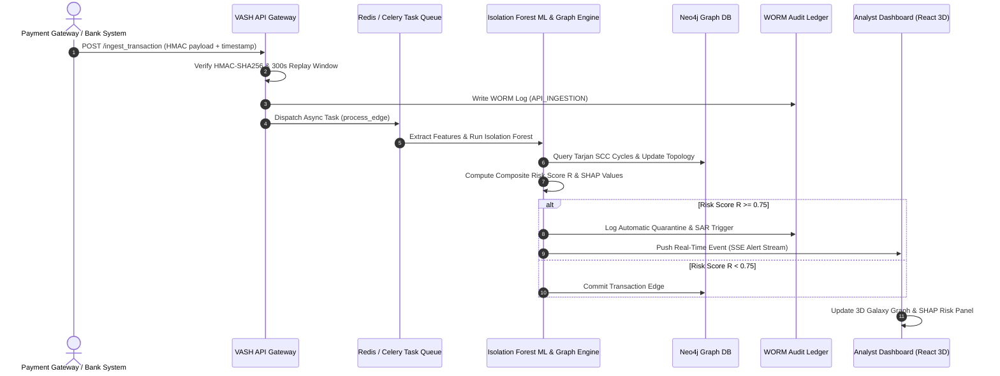

# VASH Architecture & Technical Specifications

> **System Title**: VASH Autonomous Transaction Control & Threat Intelligence Platform  
> **Authors**: Vineet · Abhiram · Sakshi · Himanshu  
> **Document Status**: Production Architecture Specification  

---

## 1. System Overview & Mission

**VASH** is an enterprise-grade, real-time transaction control and threat detection architecture designed to monitor incoming and outgoing payment streams, intercept compromised accounts, and disrupt multi-hop financial fraud networks in sub-millisecond latencies.

VASH operates on a **Federated Dual-Engine Model** combining **Unsupervised Machine Learning (Isolation Forest Anomaly Detection)**, **Deterministic Graph Analytics (Tarjan's Strongly Connected Components)**, **Post-Quantum Cryptography (PQC SDK Gate)**, and **Private Set Intersection (PSI)**.

```
                           +------------------------------------------+
                           |    Ingress Payment Stream (UPI/SWIFT)    |
                           +------------------------------------------+
                                                |
                                                v
                           +------------------------------------------+
                           |    VASH Neural API Ingestion Gateway     |
                           |     (HMAC-SHA256 / Replay Shield)        |
                           +------------------------------------------+
                                                |
               +--------------------------------+--------------------------------+
               |                                |                                |
               v                                v                                v
  +--------------------------+    +--------------------------+    +--------------------------+
  |  Isolation Forest Engine |    |  Tarjan SCC Graph Net    |    |   Cryptographic PQC Gate |
  |   (Anomaly Scoring/SHAP) |    |  (Smurfing & Mule Cycles)|    |  (Blind PII / SDK Check) |
  +--------------------------+    +--------------------------+    +--------------------------+
               |                                |                                |
               +--------------------------------+--------------------------------+
                                                |
                                                v
                           +------------------------------------------+
                           |   Storage Mesh (Neo4j / SQLite / WORM)   |
                           +------------------------------------------+
                                                |
                                                v
                           +------------------------------------------+
                           |   VASH Security Operations Center (SOC)  |
                           |   (3D Galaxy Visualizer / 10 SOC Tabs)   |
                           +------------------------------------------+
```

---

## 2. System Layer Specifications

### 2.1 Ingress & Access Control Gateway (`main.py`)
- **FastAPI Core**: Asynchronous API server handling real-time payload ingestion.
- **HMAC-SHA256 Payload Integrity**: Validates payload signatures against shared institutional keys before routing to worker queues.
- **Replay Attack Shield**: Time-window timestamp validation (strict 300s window) rejecting stale or replayed payloads.
- **Sarvakshan MFA & PQC SDK Gate**: 
  - **Stage 1**: VPA Administrative Credentials & Password check.
  - **Stage 2**: 6-digit MFA OTP challenge.
  - **Stage 3**: Drag & Drop hardware-signed `vash_sdk.json` verification, validating `VASH-PQC-SECURE-SDK-v2.0` headers and hardware entropy checksums.

### 2.2 Asynchronous Execution & Task Queue (`tasks.py`, Redis, Celery)
- **Celery Distributed Queue**: Multithreaded/gevent background task engine executing CPU-bound feature extraction, graph updates, and model scoring in parallel.
- **Redis Cache & Velocity Ledger**: Sub-millisecond in-memory cache tracking account velocity counters (burst detection) and active quarantine states.
- **AIOKafka Event Stream Consumer**: High-throughput message ingestion loop consuming raw ledger topics (`vash-telemetry-stream`).

### 2.3 Machine Learning & Explainable AI Engine (`ml_engine.py`)
- **Unsupervised Isolation Forest**: Evaluates feature vectors $X = [\text{IP\_Val}, \text{Auth\_Val}, \text{Amount\_INR}, \text{Velocity\_Score}]$ with contamination factor $\alpha = 0.05$.
- **XAI SHAP Feature Attributions**: Calculates Shapley contribution values for each feature vector to provide explicit rationale for flagged anomalies.
- **Composite Risk Score Formulation**:
  $$R = 0.30 \cdot IF + 0.25 \cdot CYCLE + 0.15 \cdot BETWEEN + 0.15 \cdot CROSS + 0.10 \cdot VEL + 0.05 \cdot TIME$$
  Where transactions with $R \ge 0.75$ trigger immediate automated micro-freezes and WORM audit logging.

### 2.4 Topological Graph Analytics Engine (`database.py`, Neo4j, NetworkX)
- **Neo4j Property Graph**: Persists real-time account nodes (`:Account {token, risk_status}`) and directed edges (`:TRANSFERRED_TO {amount, timestamp, is_flagged}`).
- **Tarjan's Strongly Connected Components (SCC)**: Detects circular money laundering rings (e.g. $A \rightarrow B \rightarrow C \rightarrow A$) in $O(V + E)$ linear execution time.
- **Smurfing Hub Identification**: Identifies fan-out hubs funneling capital across high-degree receiver nodes.

### 2.5 Private Set Intersection (PSI) Engine (`psi_engine.py`)
- **Elliptic Curve Cryptographic Matching**: Computes blind intersections of suspect account tokens between financial institutions without revealing non-flagged accounts.
- **Zero-PII Leakage Guarantee**: Obfuscates VPAs using cryptographic blind HMAC hashing prior to cross-bank matching.

### 2.6 Storage Mesh & WORM Compliance Ledger (`audit_logger.py`, SQLite)
- **SQLite Relational Ledger**: WAL-enabled transactional persistence store (`fintech_threat_db.sqlite`) tracking transaction history, risk scores, and device fingerprints.
- **Immutable WORM Audit Chain**: Logs all administrative and automated actions into `vash_audit_worm.log` linked via SHA-256 hash chains (`prevHash` $\rightarrow$ `currHash`) and Merkle tree roots.
- **Automated Incident Filing**: Generates regulatory-compliant Suspicious Activity Reports (SARs) for CERT-In, FinCEN, and FIU compliance portals.

### 2.7 SOC Analyst Portal (`frontend/src/`)
- **3D Interactive Galaxy Topology**: Rendered using Three.js and `react-force-graph-3d` with nested spherical gravitational locks.
- **10 Security Operations Tabs**:
  1. `SystemGraphTab`: Fused 3D topology & node parameter metrics.
  2. `AllAttacksTab`: Comprehensive threat matrix & real-time attack feed.
  3. `AuditIncidentTab`: WORM audit trail & CERT-In SAR dispatcher.
  4. `AuthMonitorTab`: Zero-trust authentication monitoring & token status.
  5. `CryptoTab`: HMAC signature verification & AES envelope logs.
  6. `DatabaseTab`: Storage mesh search & multi-field query builder.
  7. `MitreAttackTab`: MITRE ATT&CK framework matrix mapping.
  8. `QuantumTab`: Post-Quantum Cryptography status & QKD coherence.
  9. `SecurityMeshTab`: Security mesh node health & active quarantines.
  10. `TelemetryTab`: Cyber telemetry & payment rail browser (UPI, NEFT, RTGS, Visa, Mastercard, SWIFT).
- **Right Dynamic Risk Panel**: Live risk gauge, SHAP attributions, node metadata, and one-click manual unfreeze/quarantine overrides.

---

## 3. Data Flow & Execution Sequence



---

## 4. Hardware & Deployment Requirements

| Component | Minimum Specification | Recommended Production Specification |
| :--- | :--- | :--- |
| **Backend API Nodes** | 4 vCPU, 8 GB RAM | 16 vCPU, 32 GB RAM (FastAPI / Uvicorn cluster) |
| **Neo4j DB Node** | 4 vCPU, 8 GB RAM | 16 vCPU, 64 GB RAM (In-Memory Heap Boosted) |
| **Redis Cache** | 2 vCPU, 4 GB RAM | 8 vCPU, 16 GB RAM (Cluster Mode with Persistence) |
| **Celery Workers** | 4 vCPU, 8 GB RAM | 16 vCPU, 32 GB RAM (Gevent / Solo Pool Execution) |
