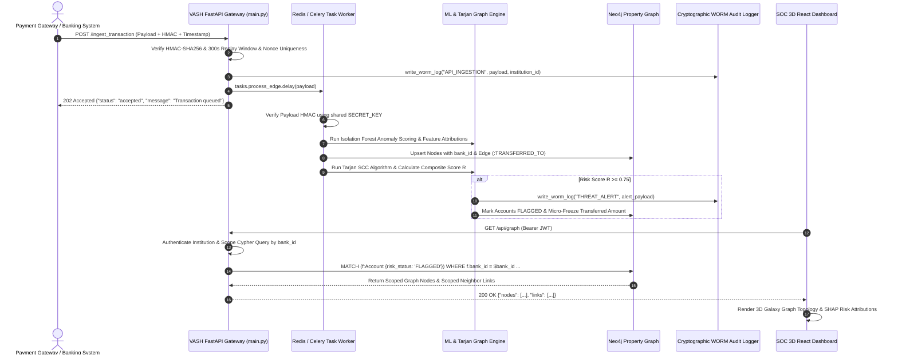

# VASH System Architecture & Technical Specification

> **System Name**: VASH — *Autonomous Real-Time Financial Graph Threat Intelligence & Transaction Control Engine*  
> **Repository**: [Hack2ignite-VASH](https://github.com/S-Abhiram05/Hack2ignite-VASH)  
> **Authors**: Vineet · Abhiram · Sakshi · Himanshu  
> **Document Status**: Production Architecture Specification  
> **Version**: 2.2 (Fully Hardened, Multi-Tenant Scoped & Vercel SPA Ready)

---

## 1. Executive Summary & Architectural Vision

**VASH** is an enterprise-scale, real-time transaction control and cyber-threat intelligence platform engineered to monitor high-volume payment streams (UPI, NEFT, RTGS, SWIFT, Visa/Mastercard), detect complex financial fraud topologies (Smurfing Hubs, Circular Laundering Rings, Velocity Bursts), and enforce zero-trust security controls with sub-millisecond latencies.

VASH operates on a **Federated Dual-Engine Architecture** that combines:
1. **Unsupervised Machine Learning**: Isolation Forest anomaly scoring paired with SHAP (SHapley Additive exPlanations) feature attributions.
2. **Topological Graph Analytics**: Neo4j property graph engine coupled with Tarjan's $O(V+E)$ Strongly Connected Components (SCC) cycle detection algorithm.
3. **Cryptographic Zero-Trust Gateway**: 3-Stage authentication gate (Credentials $\rightarrow$ Server-Verified 6-digit MFA OTP Challenge $\rightarrow$ Hardware-Signed PQC SDK Package Verification).
4. **Private Set Intersection (PSI)**: Salted SHA-256 multi-party dataset intersection for cross-institutional threat sharing without exposing raw account identifiers.
5. **Immutable Chained WORM Ledger**: Append-only audit logger using canonical JSON formatting and SHA-256 Merkle-like hash chaining (`prev_hash` $\rightarrow$ `curr_hash`).

---

## 2. High-Level System Architecture Diagram

```
+---------------------------------------------------------------------------------------------------+
|                                 PAYMENT GATEWAY / INGRESS STREAM                                  |
|                              (UPI, NEFT, RTGS, SWIFT, Card Rails)                                 |
+---------------------------------------------------------------------------------------------------+
                                                  |
                                                  v
+---------------------------------------------------------------------------------------------------+
|                                  VASH NEURAL API INGESTION GATEWAY                                |
|                                             (main.py)                                             |
|   - CORS Allowed Origin Restrictions              - Timezone UTC Normalization & 300s Window      |
|   - HMAC-SHA256 Payload Verification              - Nonce Deduplication Cache (SEEN_NONCES)       |
|   - OAuth2 Bearer Token Validation                - Strict Tenant Scoping & Bank ID Binding       |
|   - Server-Side MFA Route (/api/auth/mfa-verify)  - SPA Rewrites Configured in vercel.json       |
+---------------------------------------------------------------------------------------------------+
                                                  |
                                                  v
+---------------------------------------------------------------------------------------------------+
|                                DISTRIBUTED TASK QUEUE & WORKER POOL                               |
|                                     (Celery + Redis Broker)                                       |
|   - Async Parallel Execution                     - Redis In-Memory Velocity Counter Cache        |
|   - Task Routing: tasks.process_edge             - Gevent Worker Pool for Concurrency             |
+---------------------------------------------------------------------------------------------------+
                                                  |
                 +--------------------------------+--------------------------------+
                 |                                |                                |
                 v                                v                                v
+----------------------------------+ +----------------------------------+ +----------------------------------+
|      ISOLATION FOREST ENGINE     | |      TOPOLOGICAL GRAPH ENGINE    | |     POST-QUANTUM CRYPTO GATE     |
|          (ml_engine.py)          | |    (database.py / NetworkX)    | |        (psi_engine.py)         |
| - Unsupervised Anomaly Scoring   | | - Tarjan's $O(V+E)$ SCC Cycles  | | - Salted SHA-256 Token Cipher  |
| - SHAP Feature Attributions      | | - Smurfing Hub Fan-Out           | | - Cross-Bank Private Set Inter- |
| - Composite Score R Calculation  | | - Neighbor Scoped Cypher Filter  | |   section without PII Leakage  |
+----------------------------------+ +----------------------------------+ +----------------------------------+
                 |                                |                                |
                 +--------------------------------+--------------------------------+
                                                  |
                                                  v
+---------------------------------------------------------------------------------------------------+
|                                          STORAGE MESH                                             |
|   - SQLite (fintech_threat_db.sqlite): Institutions, Banks, Accounts, Transactions, Roles           |
|   - Neo4j Property Graph: (:Account {token, risk_status, bank_id})-[r:TRANSFERRED_TO]->(:Account) |
|   - Immutable WORM Audit Chain (vash_audit_worm.log): SHA-256 prev_hash -> curr_hash Merkle link  |
+---------------------------------------------------------------------------------------------------+
                                                  |
                                                  v
+---------------------------------------------------------------------------------------------------+
|                                 VASH SOC ANALYST PORTAL (FRONTEND)                                |
|                                   (React 18 / Three.js / Vite)                                    |
|   - 3D Interactive Galaxy Topology Visualizer    - 10 Dedicated Security Operations Tabs         |
|   - Live Real-Time Threat Telemetry Feed          - Dynamic SHAP Feature Attribution Panel        |
|   - Zero-Trust Login Gateway & MFA Step           - Automated CERT-In / FIU SAR Dispatcher        |
+---------------------------------------------------------------------------------------------------+
```

---

## 3. Core Component Specifications

### 3.1 Centralized Configuration & Environment Hardening (`config.py`)
- **Secret Management**: Reads `VASH_SECRET_KEY` and `VASH_PSI_SALT` from environment variables. If omitted, generates cryptographically secure random 256-bit process keys (`secrets.token_hex(32)`), preventing reliance on static guessable fallbacks.
- **Token Policy**: Configures HS256 JWT signing algorithms, 60-minute session expiration, and issuer string `vash.neural.core`.

### 3.2 Ingress Security & API Gateway (`main.py`)
- **Framework**: FastAPI with Uvicorn ASGI server listening on `0.0.0.0:8000`.
- **CORS Protection**: Restricted `allow_origins` to explicitly trusted frontend domains (`http://localhost:5173`, `http://127.0.0.1:5173`, `https://vash-virid.vercel.app`) with allowed methods `["GET", "POST", "OPTIONS"]`.
- **HMAC Verification**: Validates `payload_hmac` against canonical JSON payload data using `hmac.new(SECRET_KEY, ..., sha256)`.
- **Replay Protection**: Normalizes incoming timestamps to UTC ISO format, rejects timestamps outside a 300-second window, and enforces unique nonces (`bank_id:sender:receiver:timestamp:amount`) via `SEEN_NONCES`.
- **Server-Side MFA Verification Route (`/api/auth/mfa-verify`)**: Issues pre-MFA tokens during password auth (`/api/auth/login`) and grants fully verified JWT tokens only after MFA challenge verification.
- **Strict Tenant Isolation**: All database routes (`/transactions`, `/accounts`, `/api/threat-stats`, `/api/graph`) scope Cypher query matching and neighbor nodes strictly by the caller's `bank_id`.

### 3.3 Asynchronous Execution Engine (`tasks.py`, Redis, Celery)
- **Celery Worker**: Distributed task `tasks.process_edge` running over Redis broker (`redis://localhost:6379/0`).
- **Velocity Cache**: Uses Redis `StrictRedis` to maintain 60-second sliding-window transaction counters per account node.
- **Alert Dispatch**: Generates threat alerts when composite risk scores exceed the decision threshold ($R \ge 0.75$), writing to `vash_alert_v1.2.json` and triggering immutable WORM log appends.

### 3.4 Machine Learning & XAI Engine (`ml_engine.py`)
- **Isolation Forest Model**: Evaluates feature vectors $X = [\text{source\_ip\_anomaly}, \text{auth\_status\_val}, \text{amount\_inr}, \text{velocity\_score}]$ trained with contamination rate $\alpha = 0.05$.
- **Composite Risk Formulation**:
  $$R = 0.30 \cdot \text{IF\_Score} + 0.25 \cdot \text{Cycle\_Flag} + 0.15 \cdot \text{Betweenness} + 0.15 \cdot \text{Cross\_Bank} + 0.10 \cdot \text{Velocity} + 0.05 \cdot \text{Time\_Anomaly}$$
- **Decision Boundary**: Transactions with $R \ge 0.75$ trigger automatic micro-freezes and regulatory alert generation.

### 3.5 Topological Graph Engine (`database.py`, Neo4j, NetworkX)
- **Neo4j Property Graph**: Stores account nodes and directed transaction edges with properties `amount`, `timestamp`, `is_flagged`, and `fraud_pattern`.
- **Tarjan's SCC Algorithm**: Identifies circular money laundering cycles ($A \rightarrow B \rightarrow C \rightarrow A$) in linear $O(V+E)$ time complexity.
- **Smurfing Hub Detection**: Detects high-fan-out accounts funneling small-value transactions into aggregated destination accounts.

### 3.6 Private Set Intersection (PSI) Engine (`psi_engine.py`)
- **Multi-Party Computation Protocol**: Uses salted SHA-256 token hashing with explicit `hashlib` imports to convert raw tokens into ciphertexts.
- **Set Intersection**: Computes `set(bank_a).intersection(set(bank_b))` to identify common compromised accounts across institutions without exposing non-matching records.

### 3.7 Immutable Chained WORM Ledger (`audit_logger.py`)
- **Cryptographic Hash Chain**: Every event creates a log record containing:
  - `timestamp_utc`: Timezone-aware UTC ISO timestamp.
  - `payload_hash`: SHA-256 of canonical JSON payload.
  - `prev_hash`: SHA-256 hash of the immediately preceding log entry (genesis: `"0"*64`).
  - `curr_hash`: SHA-256 of `f"{timestamp}|{institution_id}|{event_type}|{payload_hash}|{prev_hash}"`.
- **WORM Storage**: Appends to `vash_audit_worm.log`, producing a tamper-evident Merkle hash chain.

### 3.8 SOC Analyst Workspace Portal (`frontend/src/`) & Vercel Deployment
- **3D Galaxy Visualizer**: Built with Three.js and `react-force-graph-3d`, displaying node risk statuses (`FLAGGED`, `ELEVATED`, `CLEAN`) with interactive camera controls.
- **10 Operations Tabs**: `SystemGraphTab`, `AllAttacksTab`, `AuditIncidentTab`, `AuthMonitorTab`, `CryptoTab`, `DatabaseTab`, `MitreAttackTab`, `QuantumTab`, `SecurityMeshTab`, `TelemetryTab`.
- **Authentication Gateway (`LoginGateway.tsx`)**: 3-Stage security flow integrated with server-side `/api/auth/mfa-verify`, enforcing `owner_vpa` matching, license signatures, and assigned RBAC roles (`ADMIN` vs `ANALYST`).
- **Vercel SPA Rewrites (`vercel.json`)**: Configured with wildcard rewrites (`/ (.*) -> /index.html`), ensuring direct URL navigation (`/login`, `/dashboard`) works seamlessly without 404 errors.

### 3.9 ATM Card Cloning & Mid-Transaction Skimming Detection Engine (`POST /api/atm/ingest`)
- **Ingestion Gateway**: Ingests physical ATM transaction telemetry (`terminal_id`, `card_token`, `entry_mode`, `atc`, `amount`, `institution_id`).
- **ISO 8583 Response Code Protocol**:
  - **ISO Code 63** (*Security Violation / Transaction Blocked*): Issued synchronously when composite skimming risk score $R \ge 0.75$, halting cash dispensing mid-stream before fund release.
  - **ISO Code 00** (*Approved*): Issued when risk score $R < 0.75$.
- **Anomaly Detection Vector**:
  - `entry_mode == '90'`: Magstripe Fallback anomaly on EMV Chip-enabled accounts.
  - `atc <= historical_atc`: Application Transaction Counter sequence regression, detecting cloned EMV card chip replay attacks.
- **Graph & WORM Integration**: Writes `ATM_SKIMMING_INTERCEPTED` entries to `vash_audit_worm.log` and upserts `(:ATMTerminal)` nodes linked via `(:ATMTerminal)-[:DISPENSED_TO]->(:Account)` edges in Neo4j.

---

## 4. End-to-End Execution Sequence Diagram


```mermaid
sequenceDiagram
    autonumber
    actor PaymentApp as Payment Gateway / Banking System
    participant API as VASH FastAPI Gateway (main.py)
    participant TaskQueue as Redis / Celery Task Worker
    participant MLGraph as ML & Tarjan Graph Engine
    participant Neo4jDB as Neo4j Property Graph
    participant WORMLog as Cryptographic WORM Audit Logger
    participant Frontend as SOC 3D React Dashboard

    PaymentApp->>API: POST /ingest_transaction (Payload + HMAC + Timestamp)
    API->>API: Verify HMAC-SHA256 & 300s Replay Window & Nonce Uniqueness
    API->>WORMLog: write_worm_log("API_INGESTION", payload, institution_id)
    API->>TaskQueue: tasks.process_edge.delay(payload)
    API-->>PaymentApp: 202 Accepted {"status": "accepted", "message": "Transaction queued"}
    
    TaskQueue->>TaskQueue: Verify Payload HMAC using shared SECRET_KEY
    TaskQueue->>MLGraph: Run Isolation Forest Anomaly Scoring & Feature Attributions
    TaskQueue->>Neo4jDB: Upsert Nodes with bank_id & Edge (:TRANSFERRED_TO)
    TaskQueue->>MLGraph: Run Tarjan SCC Algorithm & Calculate Composite Score R
    
    alt Risk Score R >= 0.75
        MLGraph->>WORMLog: write_worm_log("THREAT_ALERT", alert_payload)
        MLGraph->>Neo4jDB: Mark Accounts FLAGGED & Micro-Freeze Transferred Amount
    end
    
    Frontend->>API: GET /api/graph (Bearer JWT)
    API->>API: Authenticate Institution & Scope Cypher Query by bank_id
    API->>Neo4jDB: MATCH (f:Account {risk_status: 'FLAGGED'}) WHERE f.bank_id = $bank_id ...
    Neo4jDB-->>API: Return Scoped Graph Nodes & Scoped Neighbor Links
    API-->>Frontend: 200 OK {"nodes": [...], "links": [...]}
    Frontend->>Frontend: Render 3D Galaxy Graph Topology & SHAP Risk Attributions
```

---

## 5. Deployment & System Requirements Matrix

| Layer | System Component | Minimum Requirements | Production Requirements |
| :--- | :--- | :--- | :--- |
| **API Gateway** | Python 3.10+, FastAPI, Uvicorn | 2 vCPU, 4 GB RAM | 8 vCPU, 16 GB RAM (Gunicorn/Uvicorn cluster) |
| **Task Queue** | Celery 5.x, Redis 7.x | 2 vCPU, 4 GB RAM | 4 vCPU, 8 GB RAM (Redis Sentinel/Cluster) |
| **Graph DB** | Neo4j 5.x Enterprise / Community | 4 vCPU, 8 GB RAM | 16 vCPU, 32 GB RAM (Heap/Pagecache optimized) |
| **Relational DB**| SQLite 3 (WAL Mode) | 1 vCPU, 2 GB RAM | 4 vCPU, 8 GB RAM (PostgreSQL 15+ in production) |
| **Frontend** | Node.js 18+, React 18, Vite | 1 vCPU, 2 GB RAM | CDN Edge Hosting (Vercel with SPA Rewrites) |
